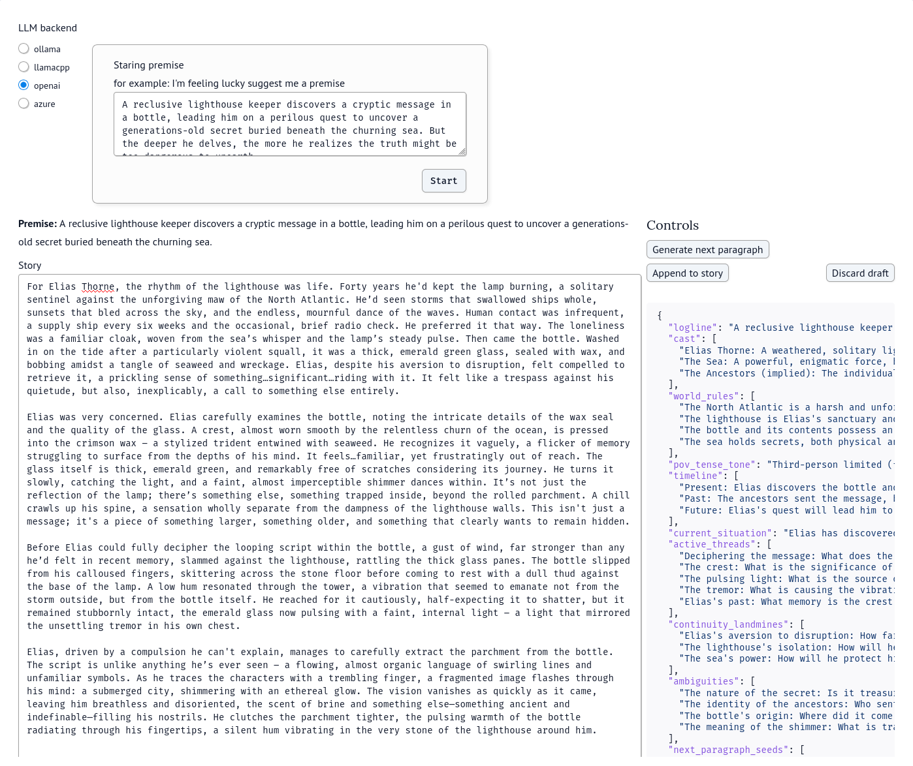
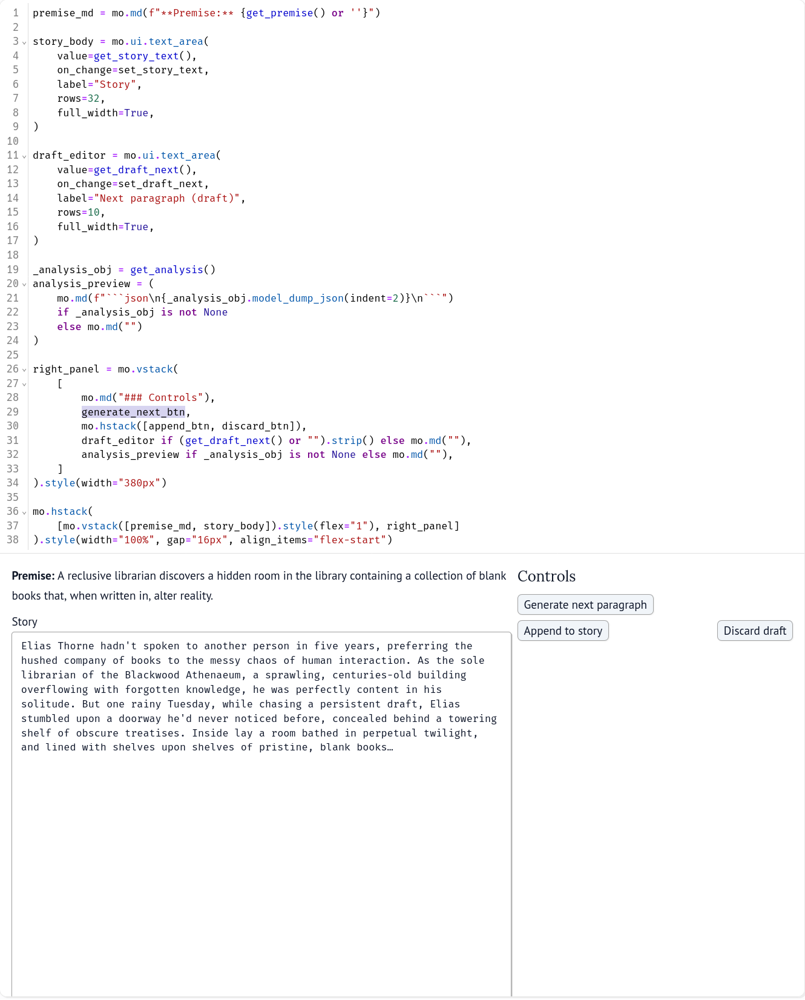
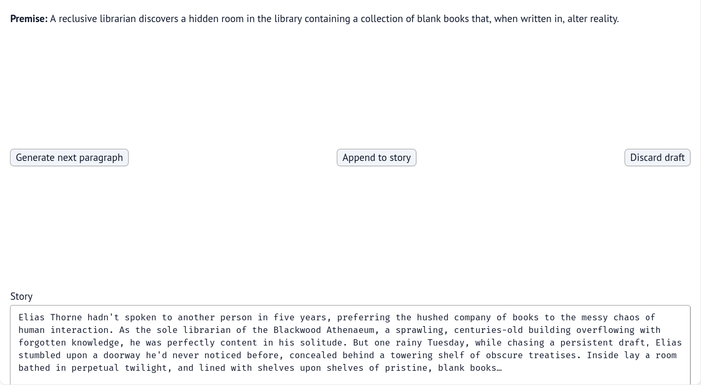
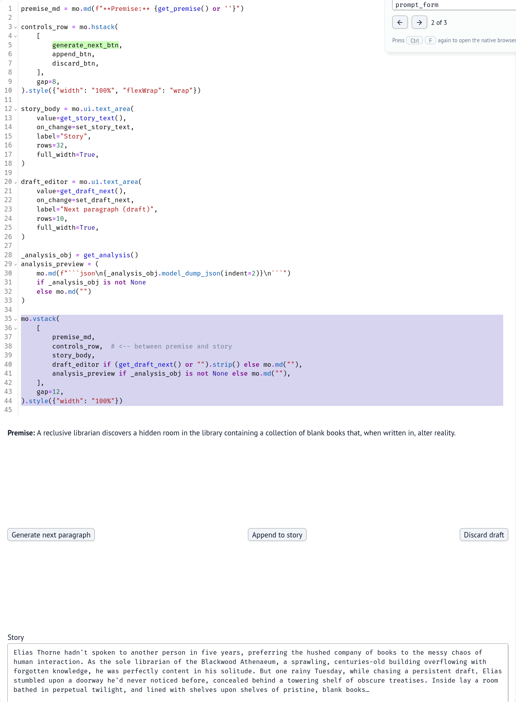
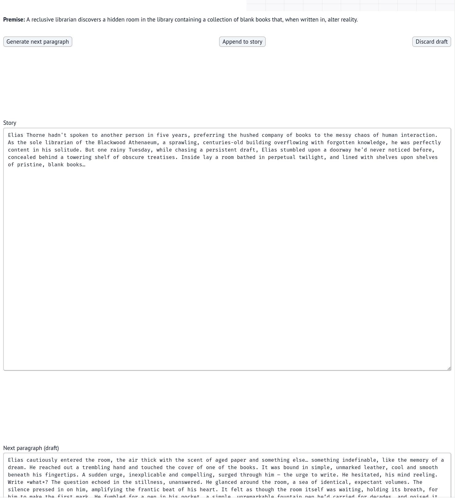
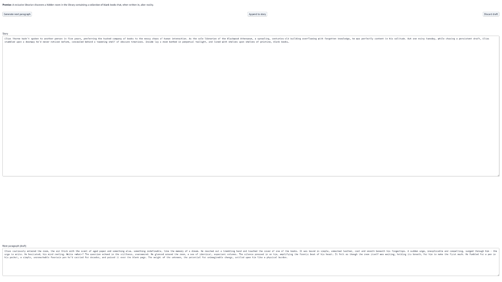
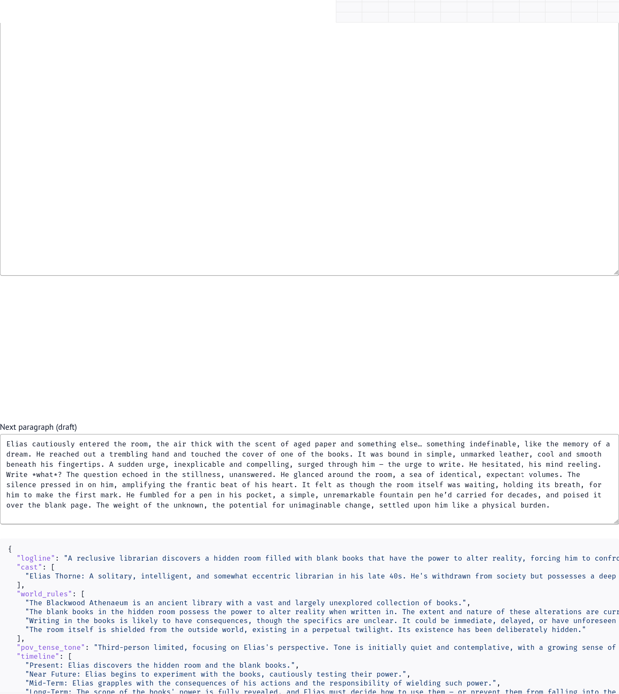
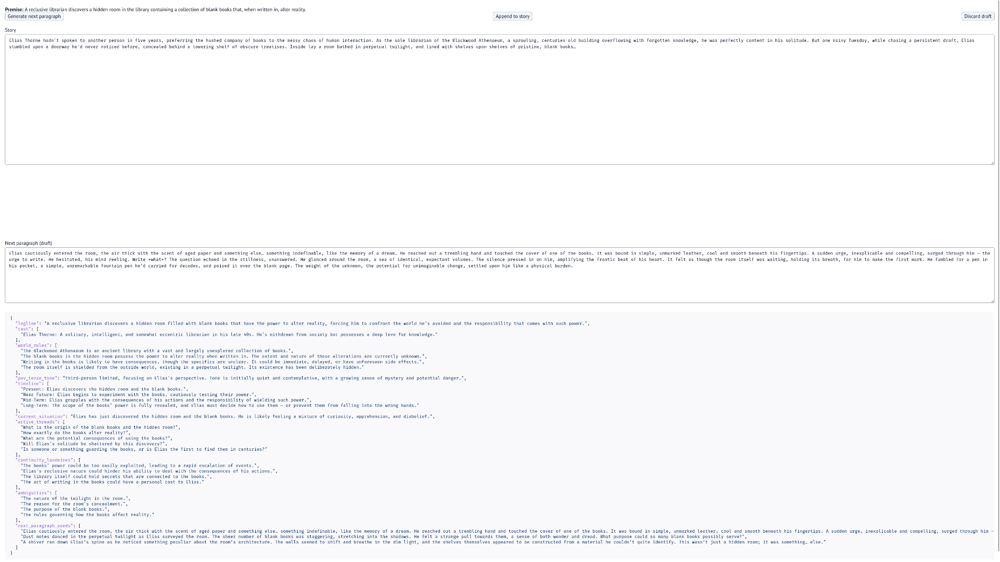
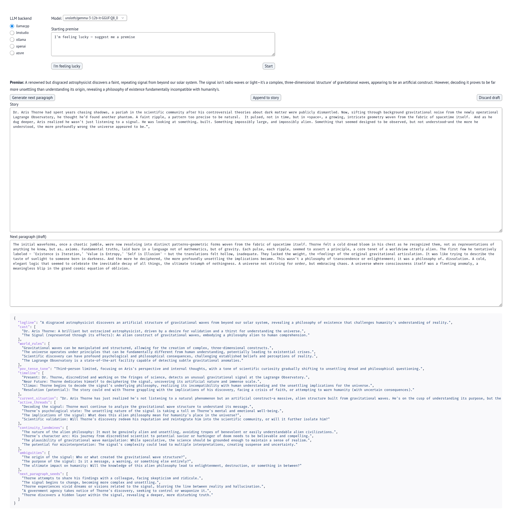

# 2025-12-29
## Overall Progress
- [x] Record a chinese demo
- [x] Add LM Studio as a endpoint
- [x] Tweaks to the ui

## Tweaks to the ui
### Adding a I'm feeling lucky button
I wanted to make a `I'm feeling lucky button` like google where I let the llm come up with a premise. While recording the chinese demo, I got tired of copy/pasting the `I'm feeling lucky — suggest me a premise` text from the starting premise. 

Passing a screenshot and the code to chatgpt, it took care of generating the code. There was some back and forth adjustments, but once it was good enough for my tastes I moved on. Maybe in the future I can have it mimic google where the `I'm feeling lucky` button text will change with a shortened 1 word preview of the premise 

### Learning style and gaps
The first version that I put within the [readme](../README.md) I had was alright, but I didn't like that paragraph got squished by the analysis/controls.


#### Moving controls from right to below the premise
Ideally the controls would be below the story text. I had chatgpt update it by attaching this screenshot and giving it this prompt

> how do I make it so that the story field will extend onto the right in the whitespace below controls and just make controls inline with premise

The first version was alright, but I didn't like how much space there was
 

I passed in another screenshot with the code and the propmpt

> can we remove the whitespace in between premise and the buttons

some hallucinated variables later the output was closer to my liking

With some later prompts Chatgpt suggested tweaking the `marginTop` parameter within the style function
``` py
controls_row = mo.hstack(
    [generate_next_btn, append_btn, discard_btn],
    gap=8,
).style(
    {
        "width": "100%",
        "flexWrap": "wrap",
        "justifyContent": "flex-start",
        "alignItems": "center",
        "margin": "0",
        "padding": "0",
        "marginTop": "-6px",  # pull buttons up (tune -4px .. -10px)
    }
)
```
I tweaked it down to `-6px` to get the final version

#### Reducing the gap between `Story` and `Next Paragraph`
The next step is to reduce white space between `Story` and `Next Paragraph`


Some prompts with chatgpt later I got it to make it slightly closer, but still not quite right. 

Attaching this screenshot and this prompt


<blockquote>

how do I make the spacing consistent with my premise, buttons story, and analysis
```py
premise_md = mo.md(f"**Premise:** {get_premise() or ''}").style(
    {"margin": "0", "padding": "0", "lineHeight": "1.1"}
)

controls_row = mo.hstack(
    [generate_next_btn, append_btn, discard_btn],
    gap=8,
).style(
    {
        "width": "100%",
        "flexWrap": "wrap",
        "justifyContent": "flex-start",
        "alignItems": "center",
        "margin": "0",
        "padding": "0",
        "marginTop": "-6px",  # pull buttons up (tune -4px .. -10px)
    }
)

header = mo.vstack([premise_md, controls_row], gap=0).style(
    {"width": "100%", "margin": "0", "padding": "0"}
)

story_body = mo.ui.text_area(
    value=get_story_text(),
    on_change=set_story_text,
    label="Story",
    rows=20,          # rows becomes less important
    full_width=True,
).style({"margin": "0", "padding": "0", "flex": "1", "minHeight": "0"})

draft_editor = mo.ui.text_area(
    value=get_draft_next(),
    on_change=set_draft_next,
    label="Next paragraph (draft)",
    rows=8,
    full_width=True,
).style({"margin": "0", "padding": "0"})

_analysis_obj = get_analysis()
analysis_preview = (
    mo.md(f"

json\n{_analysis_obj.model_dump_json(indent=2)}\n

").style(
        {"margin": "0", "padding": "0", "lineHeight": "1.1"}
    )
    if _analysis_obj is not None
    else mo.md("")
)

bottom_block = mo.vstack(
    [
        draft_editor if (get_draft_next() or "").strip() else mo.md(""),
        analysis_preview if _analysis_obj is not None else mo.md(""),
    ],
    gap=0,  # tight spacing between draft + analysis
).style({"margin": "0", "padding": "0", "width": "100%"})

mo.vstack(
    [
        header,
        story_body,
        bottom_block,
    ],
    gap=1,  # tighter overall spacing
).style(
    {
        "width": "100%",
        "height": "100vh",   # fill viewport
        "display": "flex",
        "flexDirection": "column",
        "margin": "0",
        "padding": "0",
        "minHeight": "0",
    }
)
```
</blockquote>

At this point I realized that chatgpt was getting nowhere, so I decided to intervene and started modifying the gap and flex variables. To help show my changes I used a git diff of the first and last code block. Snippet 1 is the code above, and snippet 2 is the final version
```sh
diff --git a/snippet1.py b/snippet2.py
index 9ea3ff8..54dd8b3 100644
--- a/snippet1.py
+++ b/snippet2.py
@@ -1,10 +1,10 @@
 premise_md = mo.md(f"**Premise:** {get_premise() or ''}").style(
-    {"margin": "0", "padding": "0", "lineHeight": "1.1"}
+    {"margin": "0", "padding": "0", "lineHeight": "0"}
 )
 
 controls_row = mo.hstack(
     [generate_next_btn, append_btn, discard_btn],
-    gap=8,
+    gap=10,
 ).style(
     {
         "width": "100%",
@@ -13,11 +13,11 @@ controls_row = mo.hstack(
         "alignItems": "center",
         "margin": "0",
         "padding": "0",
-        "marginTop": "-6px",  # pull buttons up (tune -4px .. -10px)
+        "marginTop": "-8px",  # pull buttons up (tune -4px .. -10px)
     }
 )
 
-header = mo.vstack([premise_md, controls_row], gap=0).style(
+header = mo.vstack([premise_md, controls_row], gap=1).style(
     {"width": "100%", "margin": "0", "padding": "0"}
 )
 
@@ -25,21 +25,21 @@ story_body = mo.ui.text_area(
     value=get_story_text(),
     on_change=set_story_text,
     label="Story",
-    rows=20,          # rows becomes less important
+    rows=25,          # rows becomes less important, try to sync up the row to the min height as that will scale the text box to the whitespace to the next element
     full_width=True,
-).style({"margin": "0", "padding": "0", "flex": "1", "minHeight": "0"})
+).style({"margin": "0", "padding": "1", "flex": "1 1 auto", "minHeight": "25"})
 
 draft_editor = mo.ui.text_area(
     value=get_draft_next(),
     on_change=set_draft_next,
     label="Next paragraph (draft)",
-    rows=8,
+    rows=13,
     full_width=True,
 ).style({"margin": "0", "padding": "0"})
 
 _analysis_obj = get_analysis()
 analysis_preview = (
-    mo.md(f"json\n{_analysis_obj.model_dump_json(indent=2)}\n").style(
+    mo.md(f"```json\n{_analysis_obj.model_dump_json(indent=2)}\n```").style(
         {"margin": "0", "padding": "0", "lineHeight": "1.1"}
     )
     if _analysis_obj is not None
@@ -60,7 +60,7 @@ mo.vstack(
         story_body,
         bottom_block,
     ],
-    gap=1,  # tighter overall spacing
+    gap=0,  # tighter overall spacing
 ).style(
     {
         "width": "100%",
```
From this manual tuning I figured out there's a couple of components that allow me to change the position of the elements these were my notes:
- `gap`: a parameter for a given stack object, `0` will make it tighter
- `rows`: a parameter for a `text_area` object. If using with styling, make sure to match up with the `minHeight` parameter
- `.style({})`: follows css logic to adjust. I can't remember how to change it, just asked Chatgpt to adjust it
  - `marginTop`: 
I don't remember what else I changed, so I just had Chatgpt look at the git diff, and the before/after screenshots


 | Before | After |
|---|---|
|  | |