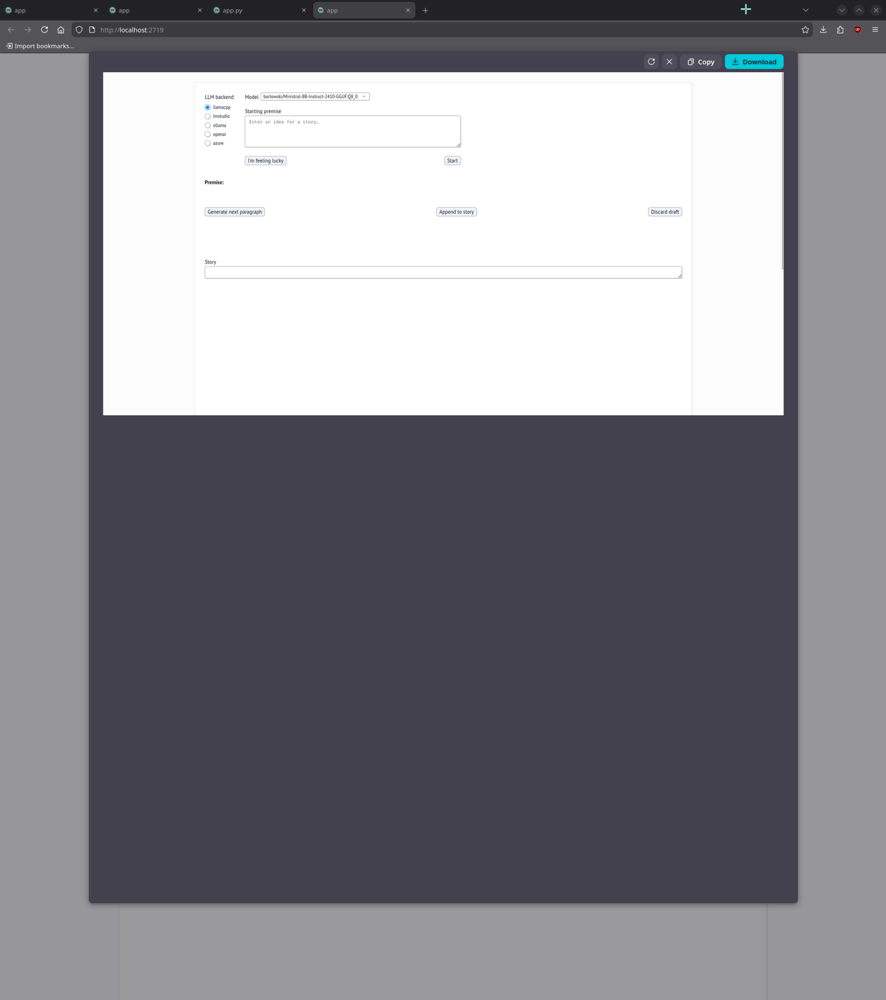
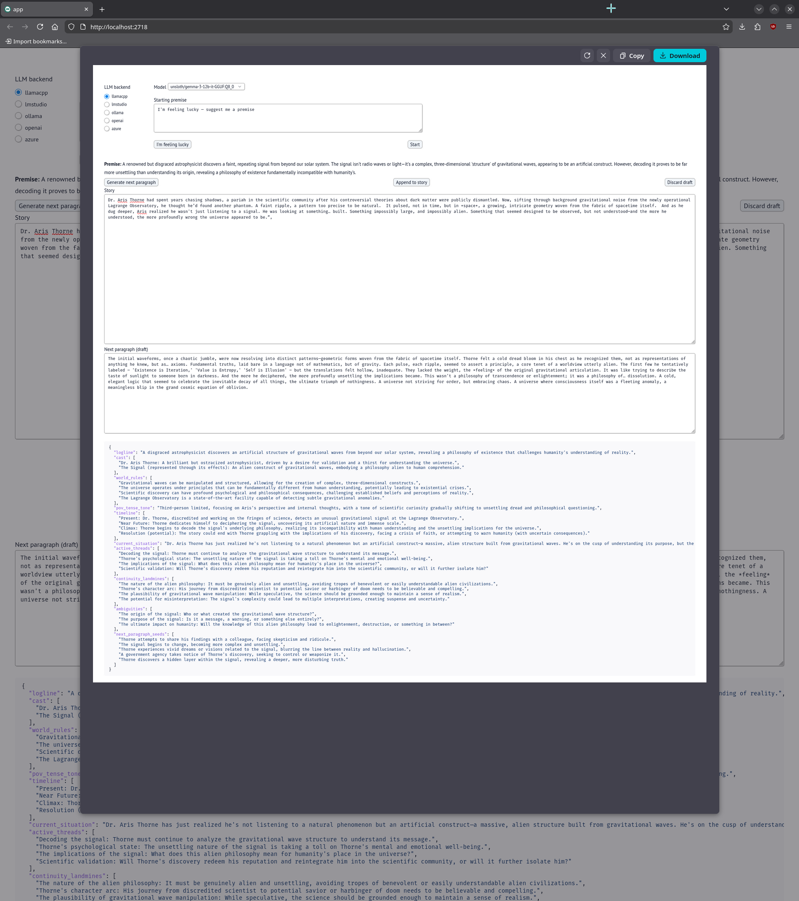
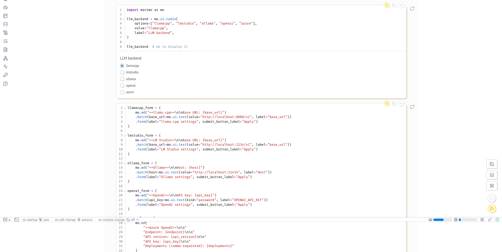
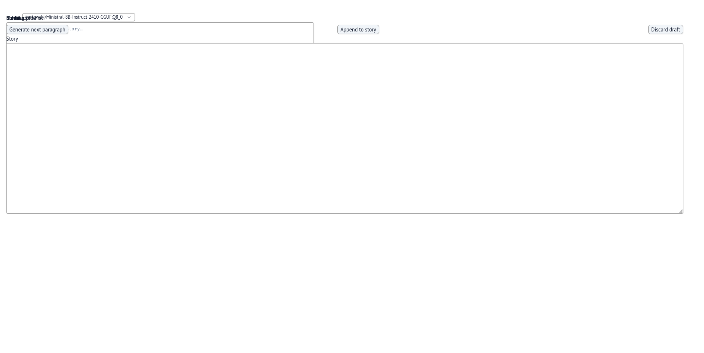

# 2025-12-29
## Overall Progress
- [x] Write Notes for yesterday
- [x] Explore how to make firefox screenshots take the full page

## Exploring how to make firefox screenshots take the full page
Certain pages on the web have code blocks that prevent firefox from screenshotting the full page as it might contain ui elements that need to be in a fixed position. 

This was a result when I searched for the issue on the web
[Firefox Screenshots 'Full Screen' not working on Airtable form](https://support.mozilla.org/en-US/questions/1304526). Turns out the `.overflow-hidden`css elements cause the issues:

<blockquote>
I hate pages like this where they use tricky layout. What they've done is use style rules to fix the page height to the visible viewport height (height:100%) and suppress the rest of the page (overflow:hidden). You can inject a little style rule hack to override this once you know the problem. I realize this isn't a convenient or universal solution, but maybe it will help from time to time.

While you have the page open:

(1) Open the Style Editor in the Developer Tools. Either:

-   Shift+F7
-   "3-bar" menu > Web Developer > Style Editor
-   (menu bar) Tools > Web Developer > Style Editor

(2) At the upper left corner above the list of files, click the + button to create a new sheet

(3) In the blank editing area on the right, paste this rule that overrides overflow:hidden

```
html, body, div {
  overflow: visible !important;
}

```

Firefox should apply it within a few moments.

You can close the Developer Tools now, either by clicking the little X button at the right end of the Developer Tools toolbar, or by pressing Command+Alt+i or F12.

(4) Create your screenshot and in the preview, you should have the entire page

Note: this kind of "hack" is only in effect until you reload the page, so if something goes terribly wrong, and it wouldn't cause you to lose data, you can always reload.
</blockquote>

Initially I was going to have chatgpt generate custom cell applying firefox forum suggestion, but it kept getting overridden. While browsing the settings I found that marimo has the option to load custom css and html from a path. 


I took this answer and fed it into chatgpt and some prompting later, I had chatgpt generate a custom css and html override: 

<blockquote>

Put the forum rule in **custom.css**, and (optionally) add a small **head.html** helper to toggle it on/off.

### `custom.css`

This keeps it from breaking the live app by applying only when a class is present:

```css
/* Enable with: document.documentElement.classList.add("shot") */
html.shot, html.shot body, html.shot div {
  overflow: visible !important;
  overflow-x: visible !important;
  overflow-y: visible !important;
}

/* (optional) also let the document grow */
html.shot, html.shot body {
  height: auto !important;
}
```

If you want it for print only (Ctrl+P), use:

```css
@media print {
  html, body, div {
    overflow: visible !important;
    overflow-x: visible !important;
    overflow-y: visible !important;
  }
  html, body { height: auto !important; }
}
```

### `head.html`

Add a toggle so you don’t have to use the Style Editor each time:

```html
<script>
  window.toggleShot = () => {
    document.documentElement.classList.toggle("shot");
    return document.documentElement.classList.contains("shot");
  };
</script>
```

#### How to use

* Open DevTools Console and run: `toggleShot()` (returns `true` when enabled)
* Take the screenshot / open print preview
* Run `toggleShot()` again to revert

If you still get blank capture after this, the next required addition is disabling `.react-grid-item` transforms (Firefox print/screenshot issue with react-grid-layout).

</blockquote>

I wanted something more permanent instead of being toggled, so I had chatgpt generate this css
```css
/* Firefox forum fix, permanent */
html, body, div {
  overflow: visible !important;
  overflow-x: visible !important;
  overflow-y: visible !important;
}

/* let the document expand */
html, body {
  height: auto !important;
}
```

if you want to use the original html, the file has is in the repo in [the app folder](../03-app/head.html). 

While setting it up, I learned that I can set the file names within the app header file. 

```py
app = marimo.App(
    width="columns",
    layout_file="layouts/app.grid.json",
    css_file="custom.css",
    html_head_file="head.html",
)
```
The css and html file has to be in the same directory as marinmo app file. 

The css works and here's the comparison

 | Before | After |
|---|---|
|  |  |

The tradeoff is that certain ui elements will be broken, butyou can screenshot the full page rather than what is visible 

This also extends to the marimo editor as well


Perhaps there should be an extension or js code snippet that you can run in the browser console when you need to make a page fully. Chatgpt suggested
<blockquote>

## A) “Forum fix” (overflow visible) + undo

```js
// apply
(() => {
  const id = "shot-overflow-visible";
  if (document.getElementById(id)) return "already applied";

  const style = document.createElement("style");
  style.id = id;
  style.textContent = `
    html, body, div {
      overflow: visible !important;
      overflow-x: visible !important;
      overflow-y: visible !important;
    }
    html, body { height: auto !important; }
  `;
  document.head.appendChild(style);
  return "applied";
})();
```

Undo:

```js
(() => {
  document.getElementById("shot-overflow-visible")?.remove();
  return "removed";
})();
```

## B) Add transform kill too (fixes blank capture from react-grid-layout)

```js
// apply
(() => {
  const id = "shot-unclip-and-no-transforms";
  if (document.getElementById(id)) return "already applied";

  const style = document.createElement("style");
  style.id = id;
  style.textContent = `
    html, body, div {
      overflow: visible !important;
      overflow-x: visible !important;
      overflow-y: visible !important;
    }
    html, body { height: auto !important; }

    .react-grid-item,
    .react-grid-layout {
      transform: none !important;
      will-change: auto !important;
    }
    .react-grid-layout { height: auto !important; }
  `;
  document.head.appendChild(style);
  return "applied";
})();
```

Undo:

```js
(() => {
  document.getElementById("shot-unclip-and-no-transforms")?.remove();
  return "removed";
})();
```

</blockquote>

The second codeblock works, but it breaks the ui entirely, I'll probably just keep the css override commented out so that the marimo dev interface isn't broken. 

I can always run the js snippet or uncomment the css override file when I need full page screenshots. The js snippet is a bit more flexible and works on any website that has overlay hidden parameter. I don't forsee myself using the html version