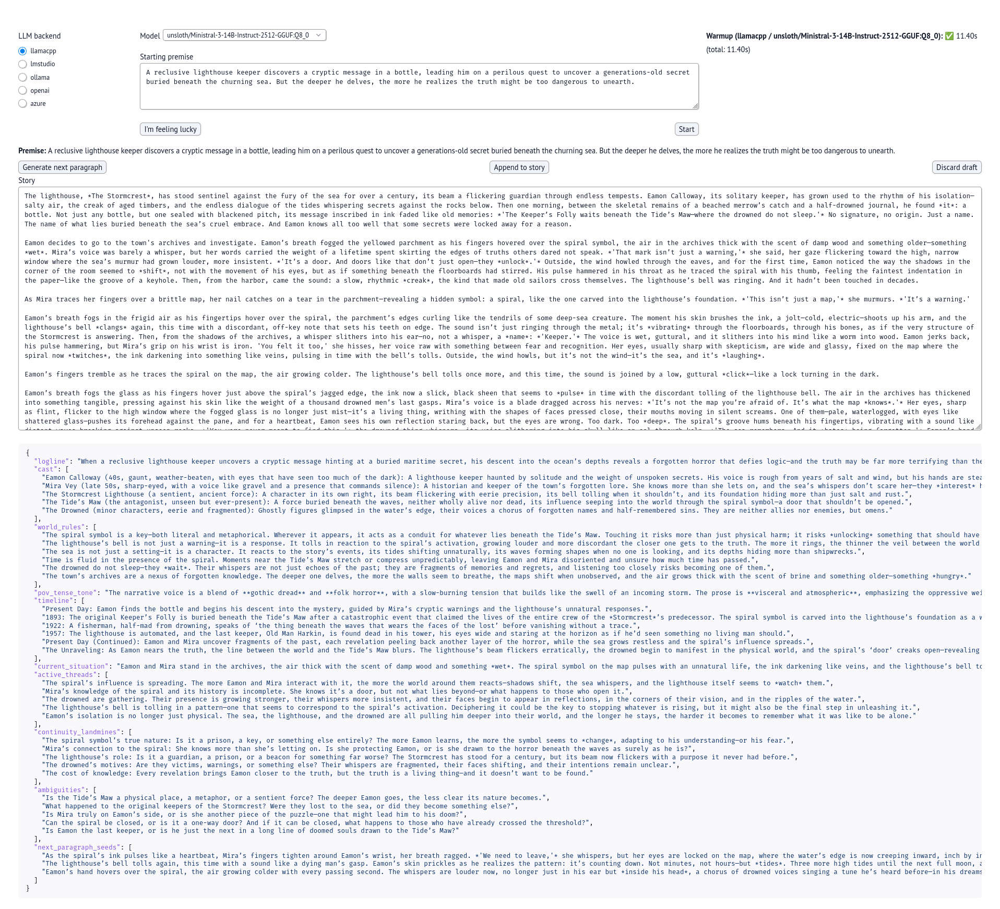

# ai-invasion
exploring making a local novel ai story writer



## Demos
### Feeling lucky?
[Feeling lucky vibe story writing](https://github.com/user-attachments/assets/967cce72-893d-47b9-ae3c-35c158e2c794)

### Long demos
[Interact with Gemma 3 12b](https://github.com/user-attachments/assets/ab2a7194-6592-48be-b9c8-fe2c6bbf9265)

[Interact with Ministral 14b](https://github.com/user-attachments/assets/cb2af3aa-b1d4-402b-ac10-59f2f9790b53)

# Background
I had chatgpt code up the front end and wrap up the code into structured outputs after seeing the [original thread](https://forum.level1techs.com/t/bedhedds-ai-invasion/235812) for the idea

> DougDoug makes interesting and entertaining videos, a series I like is his AI invasion Series with twitch chat.
> For reference here is [a playlist of the series](https://youtube.com/playlist?list=PLzY2D6XUB8KfzQbQBRV2KVxrRJ3kO1Bwo&si=uh6k-siNpcEZMxbi)
> To make the series possible, he uses [NovelAI](https://novelai.net). I wanted to make an app that you can run locally so that you can switch out models and not > worry about updates.

These are some experiments and prompts I made with chatgpt

# Building this project
To run the exploration notebook, make sure to install python with UV and ollama. When building your environment, make sure to install the dependencies (ollama, openai, etc) from the [pyproject.toml](./pyproject.toml) file

With your dependencies installed, run
``` sh
uv run marimo run 03-app/app.py
```